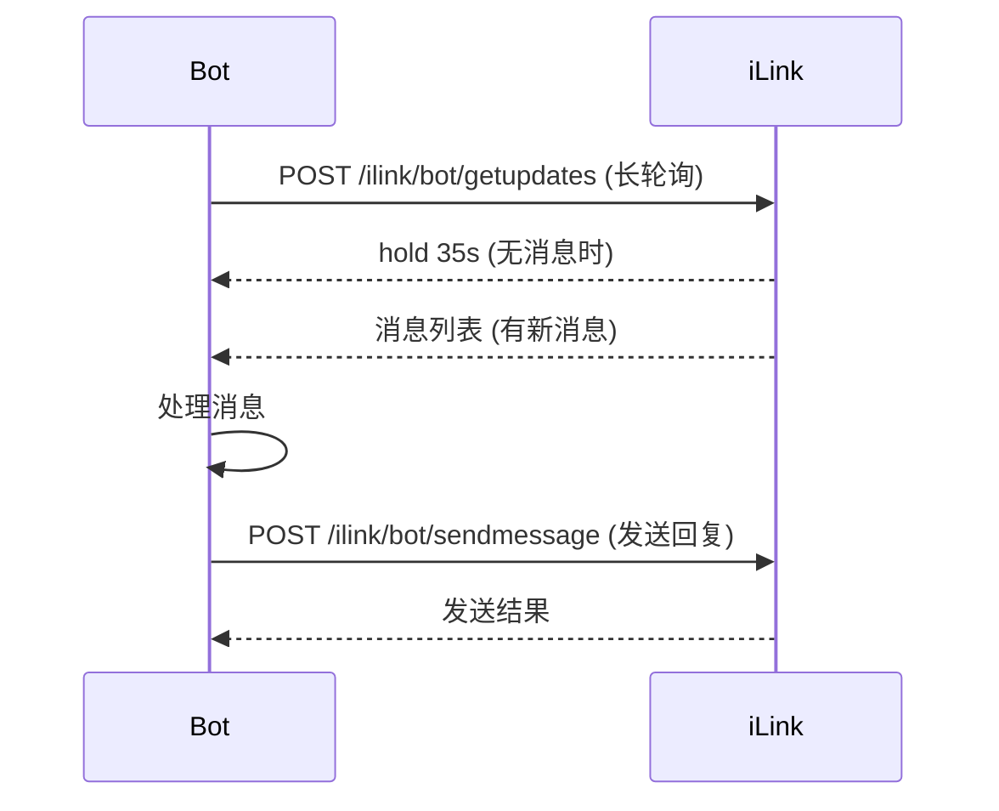
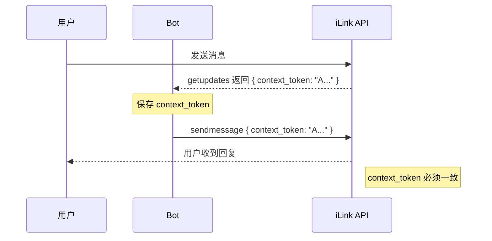
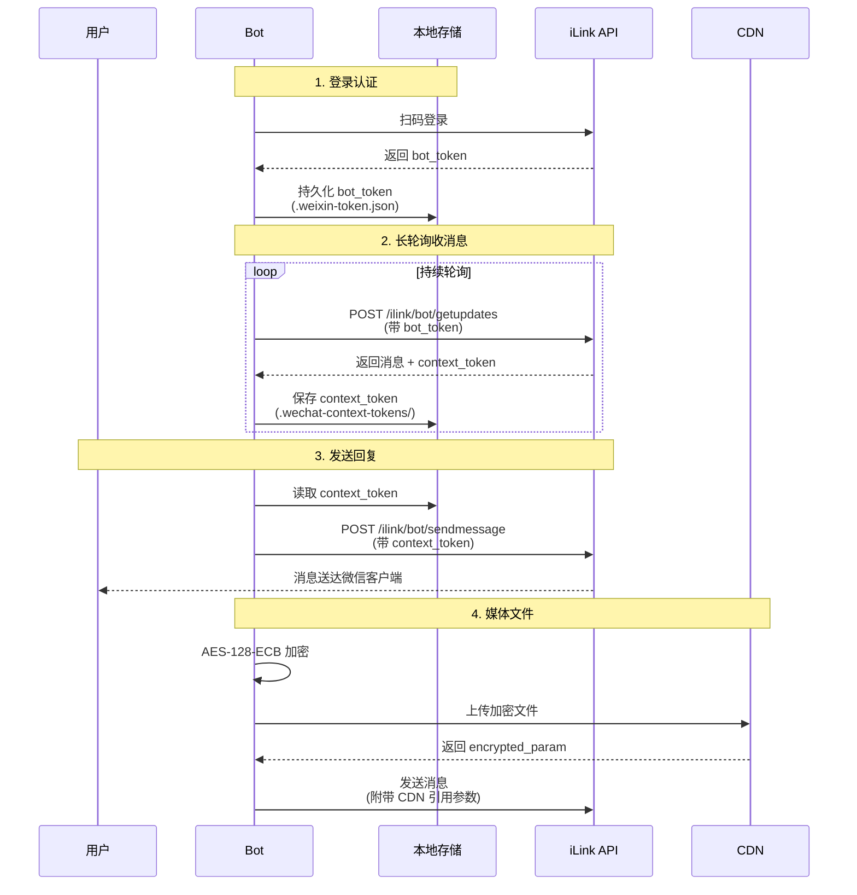
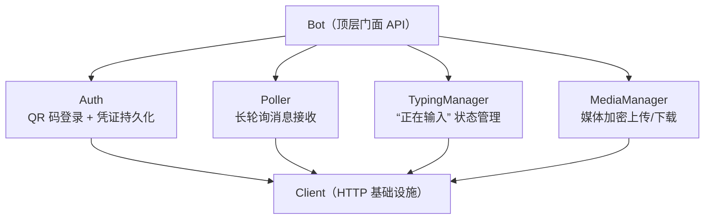

# wechat-robot-go

[](https://github.com/SpellingDragon/wechat-robot-go/actions/workflows/ci.yml)
[](https://goreportcard.com/report/github.com/SpellingDragon/wechat-robot-go)
[](https://pkg.go.dev/github.com/SpellingDragon/wechat-robot-go)
[](https://opensource.org/licenses/MIT)

基于腾讯官方 iLink Bot API 的微信机器人 Go SDK。

## 特性

- 扫码登录，凭证自动持久化
- 长轮询消息接收，HTTP 消息发送
- **context_token 持久化**，支持主动发送消息和进程重启后恢复
- Typing 状态指示（"对方正在输入中"）
- 媒体文件处理（AES-128-ECB 加密 + CDN 上传/下载）
- 零外部依赖，仅使用 Go 标准库
- Functional Options 配置模式
- 完整的 context.Context 支持

## 背景

2026 年，腾讯通过 OpenClaw 框架正式开放了微信个人账号的 Bot API（iLink 协议）。
这是微信首次提供合法的个人 Bot 开发接口，使用标准 HTTP/JSON 协议，
接入域名为 `ilinkai.weixin.qq.com`。

本 SDK 是该协议的 Go 语言封装，屏蔽底层协议细节，让开发者可以用几行代码接入微信消息。

## 快速开始

### 安装

```bash
go get github.com/SpellingDragon/wechat-robot-go
```

### 最简示例

```go
package main

import (
    "context"
    "fmt"
    "os"
    "os/signal"
    "syscall"

    "github.com/SpellingDragon/wechat-robot-go/wechat"
)

func main() {
    bot := wechat.NewBot()

    ctx, cancel := signal.NotifyContext(context.Background(), syscall.SIGINT, syscall.SIGTERM)
    defer cancel()

    // 扫码登录（首次需扫码，之后自动复用凭证）
    err := bot.Login(ctx, func(qrCode string) {
        fmt.Println("请使用微信扫描二维码:")
        fmt.Println(qrCode)
    })
    if err != nil {
        fmt.Fprintf(os.Stderr, "登录失败: %v\n", err)
        os.Exit(1)
    }

    // 注册消息处理器
    bot.OnMessage(func(ctx context.Context, msg *wechat.Message) error {
        text := msg.Text()
        if text == "" {
            return nil
        }
        // Echo 回复
        return bot.Reply(ctx, msg, "Echo: "+text)
    })

    // 启动 Bot（阻塞直到 Ctrl+C）
    fmt.Println("Bot 已启动，按 Ctrl+C 停止")
    bot.Run(ctx)
}
```

## API 文档

### Bot

| 方法 | 说明 |
|------|------|
| `NewBot(opts ...Option) *Bot` | 创建 Bot 实例 |
| `Login(ctx, onQRCode) error` | 扫码登录（已有凭证自动复用） |
| `OnMessage(handler)` | 注册消息处理回调 |
| `Run(ctx) error` | 启动长轮询循环（阻塞） |
| `Stop()` | 停止消息轮询 |
| `Reply(ctx, msg, text) error` | 回复消息（自动使用 context_token） |
| `SendText(ctx, toUserID, text, contextToken) error` | 发送文本消息 |
| `SendTyping(ctx, toUserID) error` | 显示"正在输入" |
| `StopTyping(ctx, toUserID) error` | 取消"正在输入" |
| `UploadFile(ctx, data, fileType) (*UploadResult, error)` | 上传媒体文件 |
| `DownloadFile(ctx, url, aesKey) ([]byte, error)` | 下载并解密媒体文件 |
| `Client() *Client` | 获取底层 HTTP 客户端（高级用法） |
| `SendTextToUser(ctx, toUserID, text) error` | 主动发送文本（需先有 context_token） |
| `SendImageToUser(ctx, toUserID, imageItem) error` | 主动发送图片 |
| `SendFileToUser(ctx, toUserID, fileItem) error` | 主动发送文件 |
| `GetContextToken(userID) (string, error)` | 获取用户的 context_token |
| `ClearContextToken(userID) error` | 清除用户的 context_token |
| `ClearAllContextTokens() error` | 清除所有 context_token |

### 配置选项

| Option | 说明 | 默认值 |
|--------|------|--------|
| `WithBaseURL(url)` | API 服务器地址 | `https://ilinkai.weixin.qq.com` |
| `WithTokenFile(path)` | 凭证文件路径 | `.weixin-token.json` |
| `WithContextTokenDir(dir)` | context_token 存储目录 | `.wechat-context-tokens` |
| `WithContextTokenStore(store)` | 自定义 token 存储实现 | 文件存储 |
| `WithHTTPClient(client)` | 自定义 HTTP 客户端 | `&http.Client{}` |
| `WithLogger(logger)` | 自定义日志（*slog.Logger） | `slog.Default()` |
| `WithChannelVersion(ver)` | 频道版本号 | `1.0.3` |

### 消息类型

`Message` 结构体关键字段：

| 字段 | 类型 | 说明 |
|------|------|------|
| `FromUserID` | `string` | 发送者 ID |
| `ToUserID` | `string` | 接收者 ID |
| `MessageType` | `MessageType` | 1=用户消息, 2=Bot 消息 |
| `ContextToken` | `string` | 会话 Token（回复时需传递） |
| `ItemList` | `[]MessageItem` | 消息内容列表 |

辅助方法：

| 方法 | 说明 |
|------|------|
| `Text() string` | 获取文本内容 |
| `IsFromUser() bool` | 是否为用户发送的消息 |

消息内容类型 `ItemType`：

| 常量 | 值 | 说明 |
|------|------|------|
| `ItemTypeText` | 1 | 文本 |
| `ItemTypeImage` | 2 | 图片 |
| `ItemTypeVoice` | 3 | 语音 |
| `ItemTypeFile` | 4 | 文件 |
| `ItemTypeVideo` | 5 | 视频 |

## 解绑与重新绑定

iLink Bot API 没有服务器端解绑接口。解绑的本质是清除本地 `bot_token`，之后重新扫码即可绑定新账号。

### 方式一：代码中操作

```go
// 清除本地凭证
store := wechat.NewFileTokenStore(".weixin-token.json")
_ = store.Clear()

// 重新登录（触发新 QR 码）
err := bot.Login(ctx, onQRCode)
```

### 方式二：直接删除凭证文件

```bash
rm .weixin-token.json
# 重新运行程序即可触发扫码
```

### 注意事项

- 微信端无需额外操作，清除本地 token 后服务器端自动失效
- Session 过期（`errcode: -14`）时也需要重新扫码，SDK 会通过 `IsSessionExpired()` 检测该错误
- 同一微信号每次扫码会生成新的 `bot_token`，旧 token 失效

## 通信机制

### 长轮询机制

微信 iLink Bot API 采用**长轮询**方式接收消息，类似 Telegram Bot API：



**特点**：
- 服务器最多 hold 连接 35 秒
- 有新消息立即返回
- 无消息时等待超时，正常重连

### context_token 机制（关键）

`context_token` 是微信 API 的**会话关联令牌**：

1. **每条消息都有不同的 token** - 每调用一次 `getupdates` 获取的消息都带有新的 context_token
2. **发送消息必须携带** - 回复用户消息时必须使用该消息的 context_token
3. **用于会话关联** - 服务器通过 context_token 确定消息属于哪个对话



**常见错误**：
- 第一条消息能发，后续发不了 → context_token 未更新/未持久化
- 进程重启后无法发消息 → context_token 未持久化

### 消息流程



## 持久化机制

本 SDK 实现了两级持久化机制：

### 1. Bot Token 持久化

存储登录凭证，用于 API 认证：

| 文件 | 说明 |
|------|------|
| `.weixin-token.json` | 包含 `bot_token` 和可选的 `base_url` |

**存储格式**：
```json
{
  "bot_token": "eyJ...",
  "base_url": "https://ilinkai.weixin.qq.com"
}
```

### 2. Context Token 持久化

存储用户的 context_token，支持主动发送消息：

| 文件 | 说明 |
|------|------|
| `.wechat-context-tokens/{userID}.json` | 每个用户一个文件 |

**存储格式**：
```json
{
  "token": "AARzJWAFAAABAAAAAAAp...",
  "updated_at": "2026-03-24T10:30:00Z"
}
```

**为什么需要持久化**：
- 主动发送消息（用户没有先发消息）
- 进程重启后恢复发送能力
- 支持 CLI 命令发送消息

### 自定义存储

```go
// 使用内存存储（适合单次运行）
bot := wechat.NewBot(wechat.WithContextTokenStore(
    wechat.NewMemoryContextTokenStore(),
))

// 使用数据库存储
type DBTokenStore struct {}
func (s *DBTokenStore) Save(userID, token string) error { ... }
func (s *DBTokenStore) Load(userID string) (string, error) { ... }

bot := wechat.NewBot(wechat.WithContextTokenStore(&DBTokenStore{}))
```

## 富媒体发送

### 发送图片

```go
// 方式一：一站式发送（推荐）
err := bot.SendImageFromPath(ctx, "user@im.wechat", "/path/to/image.png")

// 方式二：从内存数据发送
imageData, _ := os.ReadFile("/path/to/image.png")
result, err := bot.UploadFile(ctx, imageData, "user@im.wechat", "image")
if err != nil {
    return err
}
imageItem := bot.media.BuildImageItemPtr(result, 800, 600)
err = bot.SendImageToUser(ctx, "user@im.wechat", imageItem)
```

### 发送文件

```go
// 方式一：一站式发送（推荐）
err := bot.SendFileFromPath(ctx, "user@im.wechat", "/path/to/document.pdf")

// 方式二：从内存数据发送
fileData, _ := os.ReadFile("/path/to/document.pdf")
result, err := bot.UploadFile(ctx, fileData, "user@im.wechat", "file")
if err != nil {
    return err
}
fileItem := bot.media.BuildFileItemPtr(result, "document.pdf")
err = bot.SendFileToUser(ctx, "user@im.wechat", fileItem)
```

### 发送语音/视频

```go
// 发送语音（一站式）
err := bot.SendVoiceFromPath(ctx, "user@im.wechat", "/path/to/voice.silk", 5000) // duration in ms

// 发送视频（一站式）
err := bot.SendVideoFromPath(ctx, "user@im.wechat", "/path/to/video.mp4")
```

## 架构

SDK 采用分层架构设计：



- **Bot**: 对外暴露的简洁 API，整合所有子模块
- **Auth**: 处理二维码登录流程，凭证通过 `TokenStore` 接口持久化
- **Poller**: 实现 `/ilink/bot/getupdates` 长轮询，带自动重试和 backoff
- **TypingManager**: 管理 typing_ticket 缓存和发送状态
- **MediaManager**: 处理 AES-128-ECB 加解密，与 CDN 交互
- **Client**: 底层 HTTP 封装，处理认证头和错误

## 协议参考

- [iLink Bot API 协议分析](https://github.com/hao-ji-xing/openclaw-weixin/blob/main/weixin-bot-api.md)
- [官方插件 npm](https://www.npmjs.com/package/@tencent-weixin/openclaw-weixin)

## License

MIT License - 详见 [LICENSE](LICENSE) 文件
