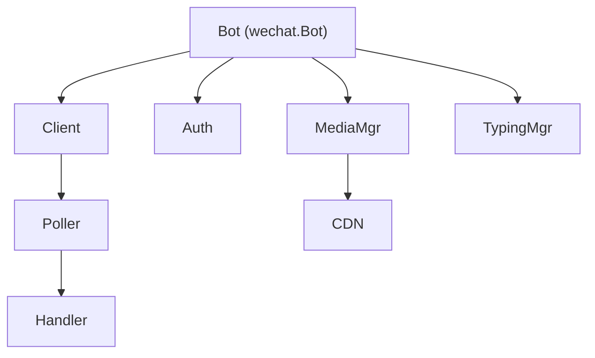

# WeChat Robot Go SDK 模块关系

## 架构概览



## 核心模块

### 1. Bot (`bot.go`)
顶层入口，整合所有子模块。

**主要功能：**
- `Login()` - QR码登录
- `Run()` - 启动消息轮询
- `OnMessage()` - 注册消息处理器
- `Reply()` - 回复文本消息
- `SendImageFromPath()` - 发送图片
- `SendVoiceFromPath()` - 发送语音
- `SendFileFromPath()` - 发送文件
- `SendVideoFromPath()` - 发送视频
- `DownloadImage()` - 下载图片
- `DownloadVoice()` - 下载语音
- `DownloadFileFromItem()` - 下载文件
- `DownloadVideoFromItem()` - 下载视频

### 2. Client (`client.go`)
HTTP客户端，负责与微信API通信。

**职责：**
- 管理认证令牌
- 发送HTTP请求
- 处理API响应

### 3. Auth (`auth.go`)
认证模块，处理登录流程。

**职责：**
- QR码登录
- Token管理
- 会话验证

### 4. MediaManager (`media.go`)
媒体文件处理核心，负责CDN上传下载。

**主要功能：**

#### 上传流程
```
本地文件 → 计算MD5 → 生成AES密钥 → 获取上传URL → 加密上传 → 返回EncryptedParam
```

**关键方法：**
- `UploadFile()` - 上传文件到CDN
- `DownloadFileWithKey()` - 从CDN下载并解密
- `BuildImageItem()` - 构建图片消息项
- `BuildVoiceItem()` - 构建语音消息项
- `BuildFileItem()` - 构建文件消息项
- `BuildVideoItem()` - 构建视频消息项

**AES密钥处理（重要）：**

| 场景 | 编码格式 | 说明 |
|------|----------|------|
| 入站(收到的消息) | base64(hex字符串) 或 base64(16字节) | 需要自动检测格式 |
| 出站(发送的消息) | base64(hex字符串) | 把hex字符串当作UTF-8文本再base64编码 |

**关键细节：** 出站时的 `aes_key` 是 **base64(hex字符串)**，不是 base64(原始16字节)！
这是因为官方插件使用 `Buffer.from(hexString).toString("base64")`，Buffer.from 不带编码参数时将字符串视为 UTF-8 文本。

```go
// 入站解密 - parseAesKey 处理两种格式
decoded := base64.DecodeString(aesKeyBase64)
if len(decoded) == 16 {
    // 直接是AES密钥
} else if len(decoded) == 32 && isHex(decoded) {
    // hex字符串，需要再解析为16字节
    aesKey = hex.DecodeString(decoded)
}

// 出站发送 - 必须是 base64(hex字符串)
// 例：hexKey = "0123456789abcdef0123456789abcdef"
// 结果：base64([]byte(hexKey)) = "MDEyMzQ1Njc4OWFiY2RlZjAxMjM0NTY3ODlhYmNkZWY="
aesKeyBase64 := base64.StdEncoding.EncodeToString([]byte(hexKey))
```

### 5. Poller (`poller.go`)
消息轮询器，通过长轮询获取新消息。

**流程：**
```
启动 → 长轮询getUpdates → 解析消息 → 调用Handler → 更新Cursor → 继续轮询
```

### 6. ContextTokenStore (`context_token.go`)
上下文令牌管理，用于消息回复关联。

**作用：**
- 存储用户会话的context_token
- 回复消息时必须携带正确的context_token

## 消息类型定义

### ItemType 枚举
```go
const (
    ItemTypeText  ItemType = 1  // 文本
    ItemTypeImage ItemType = 2  // 图片
    ItemTypeVoice ItemType = 3  // 语音
    ItemTypeFile  ItemType = 4  // 文件
    ItemTypeVideo ItemType = 5  // 视频
)
```

### CDNMedia 结构
```go
type CDNMedia struct {
    EncryptQueryParam string `json:"encrypt_query_param,omitempty"` // CDN下载参数
    AESKey           string `json:"aes_key,omitempty"`              // AES密钥(base64)
    EncryptType      int    `json:"encrypt_type,omitempty"`        // 加密类型
}
```

## 富媒体消息收发流程

### 发送图片

```
1. 读取本地图片文件
2. 计算MD5
3. MediaManager.UploadFile() 上传到CDN
   - 生成16字节AES密钥
   - AES-ECB加密文件内容
   - POST到CDN上传URL
   - 返回 EncryptedParam 和 AESKey(hex)
4. MediaManager.BuildImageItem() 构建消息项
   - 将AESKey从hex转为base64
   - 构建ImageItem结构
5. SendImageWithItem() 发送消息
   - POST到 /ilink/bot/sendmessage
```

### 接收图片

```
1. Poller 收到消息，包含ImageItem
2. ImageItem.Media.EncryptQueryParam - CDN下载参数
3. ImageItem.Media.AESKey - base64编码的密钥(hex字符串)
4. 构建下载URL:
   {cdnBaseUrl}/download?encrypted_query_param={param}
5. MediaManager.DownloadFileWithKey() 下载解密
   - base64解码获取hex字符串
   - hex解码获取16字节AES密钥
   - AES-ECB解密获得原始图片数据
```

## API 端点

| 功能 | 端点 | 说明 |
|------|------|------|
| 发送消息 | POST /ilink/bot/sendmessage | Bot发送消息给用户 |
| 轮询消息 | POST /ilink/bot/getupdates | 长轮询获取用户消息 |
| 获取上传URL | POST /ilink/bot/getuploadurl | 获取CDN上传参数 |
| 发送typing | POST /ilink/bot/sendtyping | 发送"正在输入"状态 |
| CDN上传 | POST {cdnBaseUrl}/upload | 上传加密文件到CDN |
| CDN下载 | GET {cdnBaseUrl}/download | 从CDN下载加密文件 |

## 完整示例

### Echo Bot - 接收并回显媒体

```go
bot := wechat.NewBot()

bot.OnMessage(func(ctx context.Context, msg *wechat.Message) error {
    // 获取 CDN base URL（登录后自动获取）
    cdnBaseURL := bot.CDNBaseURL()
    
    // 处理图片
    if msg.IsImage() {
        data, err := bot.DownloadImage(ctx, msg, cdnBaseURL)
        if err != nil {
            return err
        }
        
        // 保存并回显
        tmpFile := "/tmp/echo.png"
        os.WriteFile(tmpFile, data, 0644)
        defer os.Remove(tmpFile)
        
        return bot.SendImageFromPath(ctx, msg.FromUserID, tmpFile)
    }
    
    // 处理文本
    if msg.Text() != "" {
        return bot.Reply(ctx, msg, "Echo: " + msg.Text())
    }
    
    return nil
})

bot.Login(ctx, onQRCode)
bot.Run(ctx)
```

## 注意事项

1. **AES密钥编码** - 入站/出站编码不同，容易出错
2. **ContextToken** - 回复必须携带，否则消息可能发送失败
3. **CDN Base URL** - 需要正确配置，通常在登录后获取
4. **文件大小限制** - 媒体文件最大100MB
5. **消息类型过滤** - `MessageTypeUser`(1)是用户消息，`MessageTypeBot`(2)是机器人消息
